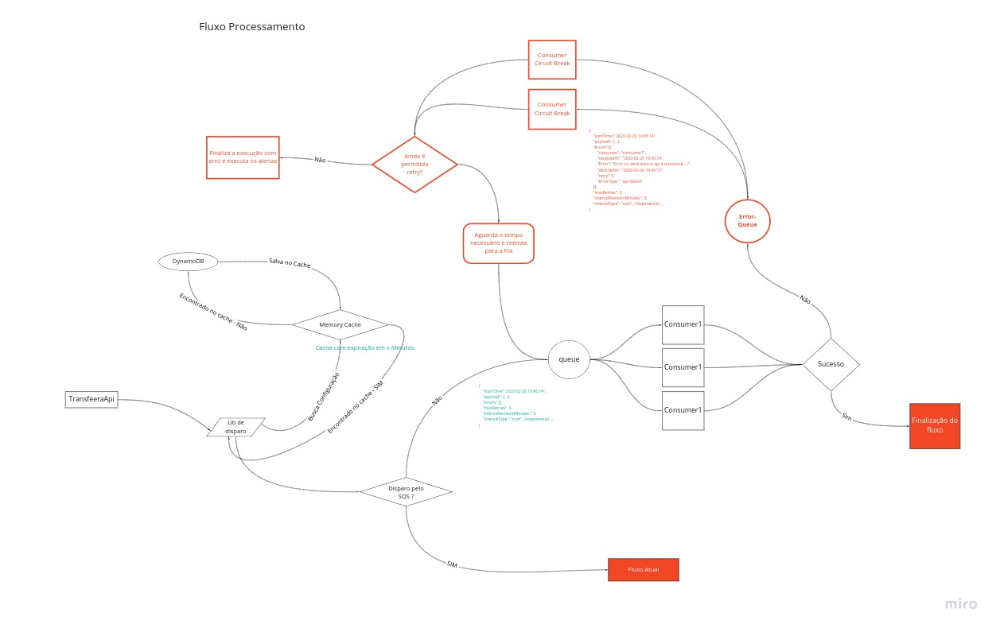
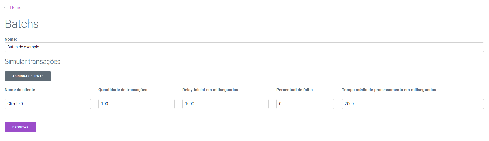
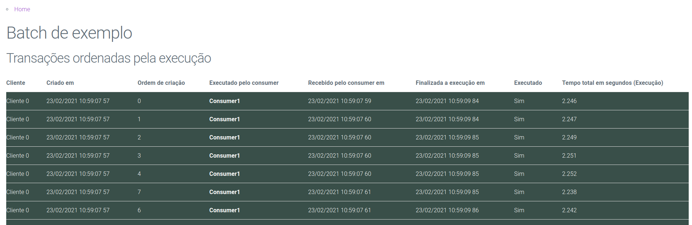

# RabbitMQ teste

## Porque este teste?
A ideia é testar diferentes simulações de diversas transações ocorrendo ao mesmo tempo para validar concorrencia entre os processos


## Pontos a considerar
A simulação não é perfeita e tende somente a dar uma noção sobre o funcionamento, o tempo de processamento simulado é usado o setTimeout o que não gera processamento real apenas aguarda, o que possibilita executar muitos processos ao mesmo tempo. Isso não inviabiliza o teste porque o ponto principal a ser validado é a entrega da mensageria porem leve em consideração que em ambiente real precisaria de muito mais consumers para dar o mesmo resultado em vazão de dados.

Outro ponto é que rodando em container estamos limitados ao numero de processadores da maquina de teste sendo que mesmo que aumentamos o numero de threads não irá aumentar o paralelismo real, em um ambiente real diversos processos em maquinas separadas poderiam ter um resultado muito mais eficiente entre a distribuição e o recebimento.


## Sobre o Rabbit





### Documentação
https://www.rabbitmq.com/getstarted.html


### Performance e custos
Os testes executados localmente não tendem a ser fieis o suficiente para um provisionamento real, porém o que foi mensurado pode dar uma noção geral.

Um processo com 200.000 transações com em média 2kb foram enviados em menos de 3 segundos com o consumo médio de 200mb de memória consumindo 60% de processamento de um clock de 2100,000 MHZ.

Esse teste deve ser executado em nuvem para uma melhor aproximação.

### Preço
A definição de preços da AWS hoje contemplam 

mq.t3.micro	 com 2 vcpu 1GB de memória e com custo de 0,04368 USD por hora

mq.m5.large	com 2 vcpu 8GB de memória e com custo de 0,459 USD por hora

#### mq.m5.large

Uso total de instâncias (em horas) = [31 dias x 24 horas/dia x 3 instâncias de agente] = 2.232 horas
x 0,459 USD
= 1024,48 USD

#### mq.m5.micro

Uso total de instâncias (em horas) = [31 dias x 24 horas/dia x 3 instâncias de agente] = 2.232 horas
x 0,04368 USD
= 97,50 USD

**Lembrando que esses valores precisam ser validados e calculados com maior precisão, eu não tenho experiencia com calculo de custos em ambiente AWS, O ideal seria montar um anbiente na AWS e validar a utilização pois me parece que o uso interno da fila é baixissimo volume.**


### Como executar localmente ?
```
docker run -d --name rabbitmq  -p 5672:5672  -p 15672:15672 rabbitmq:3-management
```
Painel de adminstração

http://localhost:15672/


## Ideia de Implementação

Construir uma classe para intermediar o envio atual para fila e antes de enviar verificar em uma tabela de configuração qual o percentual de transações serão enviadas para o RabbitMq, assim como nos consumers implementar uma classe que abstraia o recebimento das duas filas seja SQS ou RabbitMQ, isso possibilitaria uma migração gradual e segura da operação reduzindo riscos.

Implementar uma classe de cache em memória com tempo de expiração em x minutos e que possa ser usada para cada serviço buscar as configurações da base, essas configurações podem estar em um banco sql ou aproveitar o DynamoDB para isso, assim poderiamos controlar a saida dos dados sem precisar realizar novos deploys ou rollbacks de versão.

O disparo para a fila poderia ser feito apenas usando um unico tópico ou mais de um, poderiamos enviar no header da mensagem informações extras de por exemplo se a mensagem veio de um lote, se o cliente tem o SLA diferente, etc..., isso em casos extremos possibilitaria modificar em real time no painel de configuração do Rabbit definindo novas filas para processamento de acordo com os filtros desejados, exemplo : subir x PODS para apenas um cliente ou tipo de mensagem, etc...


## POC
A ideia é ter um ambiente onde podemos executar diversas transações simultaneas.

Para isso basta realizar o clone do repositório e executar
```
docker-compose up -d
```

Após isso basta abrir o browser em 

http://localhost:3000/

E cadastrar um batch de transações, ao clicar no link para o bach criado será exibido a lista de transações realizadas com o tempo de envio, tempo de recebimento, tempo de processamento, consumidor que executou o processo e o cliente simulado.

O processo é construido com os seguintes containers:

* 1 Container RabbitMQ
* 1 Container Postgresql
* 1 Container Server (Node)
* 3 Containers Consumers (Node)
* 1 Container Front (React)

Caso queira acessar o painel de administração do rabbit é em :

http://localhost:15672/


Usuário : guest

Senha : guest




Nome do clente : Nome ficticio para acompanhamento

Quantidade de transações:  Quantidade de simulações que serão geradas

Delay inicial: Serve para gerar um atraso no inicio do envio das transações

Percentual de falha: Define quantos porcento das transações irão gerar erro, a ideia seria implementar um tratamento de erro mas no momento apenas é gerado um erro e e retorna para a fila apenas um retry.

Tempo médio de processamento: Tempo de simulação de quanto tempo irá demorar o processamento de cada transação.


Tela com listagem de transações simuladas e ordenadas pela execução.